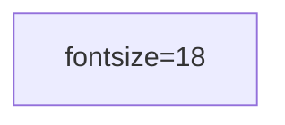

# Create Dependency Graph Skill

Create a complete puzzle dependency graph for any point-and-click adventure game.

## Purpose

Transform raw walkthrough data into a structured dependency graph that shows how puzzles relate to each other—what must be solved first, what items enable what obstacles, and how the game flows from start to finish.

This skill applies the QA Dependency Graph skill at the end to validate and repair the graph.

## Adventure Game Primer

### What Are Adventure Games?

Point-and-click adventure games (King's Quest, Monkey Island, Space Quest, Grim Fandango, The Longest Journey) have a distinctive puzzle structure:

1. **Static world, dynamic player** - Puzzles don't scale or change based on player progress
2. **Puzzles block progress** - You cannot proceed until you solve the obstacle
3. **Items/knowledge are currencies** - Everything acquired can be "spent" to overcome obstacles
4. **Solution chains** - Most puzzles require a sequence of actions, not a single click

### Puzzle Taxonomy

Understanding puzzle types helps you categorize and connect them correctly:

| Puzzle Type | Definition | Example |
|-------------|------------|---------|
| **Locked Door** | Physical obstacle requiring item | Use key on door |
| **Fetch Quest** | Acquire item, deliver to NPC/location | Get rabbit foot for gnome |
| **Information Lock** | Must learn knowledge before acting | Read book to learn spell name |
| **Barter/Brokerage** | Trade items with NPC | Trade ring for magic map |
| **Sensory Exploitation** | Use NPC's perception weakness | Give stinky flower to hiding gnome |
| **Multi-Faceted Plan** | Gather multiple items across categories, synthesize at end | Collect 5 gnome sensory items |
| **Meta-Construction** | Sequential chain where step N enables step N+1 | Lower bridge → cross → raise bridge |
| **Red Herring** | Appears required but isn't | Decoy puzzle that can be ignored |
| **Locked Choice** | Pick 1-of-N rewards (MEchanic, not puzzle) | Pawn shop: choose paintbrush OR nightingale |

### Lock/Key Model

Every puzzle has a **lock** (obstacle) and one or more **keys** (solutions):

```
LOCK: Gnome won't answer questions
KEY1: Give nightingale (sensory - appeals to hearing)
KEY2: Give rabbit foot (sensory - appeals to luck belief)
KEY3: Give mint (sensory - appeals to taste)
KEY4: Give stinky flower (sensory - appeals to... smell)
```

The dependency graph maps which keys unlock which locks, and where keys are acquired.

## Node Naming Convention

```
START              - Game start (required as first node)
A_ACTION          - Player takes action: A_PICK_UP_FLOWER, A_TALK_TO_FERRYMAN
O_OUTCOME         - Result of action: O_RECEIVE_RABBIT_FOOT, O_LEARN_SPELL
P_PROBLEM         - Obstacle to overcome: P_DOOR_LOCKED, P_GNOME_WON'T_LISTEN
C_CONSEQUENCE     - Gateway/convergence point: C_ALL_GNOME_ITEMS, C_GATE_OPENED
UNLOCK_X          - Major unlock gateway: UNLOCK_ISLAND_TRAVEL, UNLOCK_BOSS_FIGHT
END                - Game completion (required as last node)
```

### Rules for Node Naming

1. **Use ALL_CAPS with underscores**: `A_PICK_UP_FLOWER_OF_STENCH`
2. **Be specific**: `O_RECEIVE_RABBIT_FOOT`, not `O_ITEM`
3. **Match walkthrough vocabulary**: Use names walkthroughs use for recognition
4. **One item per outcome**: `O_RECEIVE_RABBIT_FOOT` and `O_RECEIVE_NIGHTINGALE` are separate nodes

## Process

### Phase 1: Gather Materials

1. **Download 3+ walkthroughs**:
   - GameFAQs (may need Wayback Machine for Cloudflare blocks)
   - Sierra Planet
   - Fan sites and wikis

2. **Create puzzle inventory document**:
   - Extract ALL puzzles systematically from each walkthrough
   - For each puzzle note: name, location, solution actions, items involved

### Phase 2: Analyze Game Structure

1. **Identify geographic areas**
   - List all distinct locations/regions
   - Note which puzzles exist in each
   - Example: KQVI has Isle of Crown, Village, Isle of Wonder, Isle of Beast, Isle of Mists, Sacred Mountain, Realm of Dead

2. **Identify problem-solution pairs**
   - Every obstacle should have explicit solution steps
   - NOT just "solve puzzle" - list specific actions
   - Example: "Give stinky flower to gnome" not "Satisfy gnome"

3. **Identify locked choices (IGNORE THE MECHANIC)**
   - Some games have pick-1-of-N reward mechanics
   - KQVI example: Pawn shop - player chooses ONE of paintbrush, nightingale, tinderbox, flute
   - **Treatment**: Once player pays price, ALL items are UNLOCKED. Don't model the choosing.
   - Show: `O_PAINTBRUSH_UNLOCKED`, `O_NIGHTINGALE_UNLOCKED`, etc.

4. **Identify major unlocks (GATEWAY CANDIDATES)**
   - Items/spells that unlock access to new areas or major game sections
   - KQVI example: Magic Map enables travel to 4 other islands
   - **Treatment**: Create `UNLOCK_ISLAND_TRAVEL` gateway node

### Phase 3: Build the Graph

#### Step 1: Start and End

```mermaid
flowchart TD
    START --> [first puzzle area]
    [final puzzle area] --> END
```

#### Step 2: Connect Actions to Outcomes

For EVERY action, show its result:

```mermaid
A_PICK_UP_FLOWER --> O_RECEIVE_FLOWER_OF_STENCH
A_TALK_TO_FERRYMAN --> O_RECEIVE_RABBIT_FOOT
```

**Critical**: Every `A_` node must connect to its `O_` node.

#### Step 3: Connect Outcomes to Consuming Actions

Items must connect to where they're used:

```mermaid
O_RECEIVE_FLOWER_OF_STENCH --> A_GIVE_FLOWER_TO_GNOME
O_RECEIVE_RABBIT_FOOT --> A_GIVE_RABBIT_FOOT_TO_GNOME
```

#### Step 4: Handle Multi-Faceted Plans

When multiple items converge:

```mermaid
O_RECEIVE_NIGHTINGALE --> C_ALL_GNOME_ITEMS
O_RECEIVE_MINT --> C_ALL_GNOME_ITEMS
O_RECEIVE_RABBIT_FOOT --> C_ALL_GNOME_ITEMS
O_RECEIVE_STINKY_FLOWER --> C_ALL_GNOME_ITEMS
C_ALL_GNOME_ITEMS --> P_GNOME_UNLOCKED
```

#### Step 5: Create Gateway Nodes for Major Unlocks

**When**: 5+ edges would cross between areas

**How**: Single concrete unlock node

```mermaid
O_RECEIVE_MAGIC_MAP --> UNLOCK_ISLAND_TRAVEL
UNLOCK_ISLAND_TRAVEL --> P_CAN_TRAVEL_TO_WONDER
UNLOCK_ISLAND_TRAVEL --> P_CAN_TRAVEL_TO_BEAST
UNLOCK_ISLAND_TRAVEL --> P_CAN_TRAVEL_TO_MISTS
UNLOCK_ISLAND_TRAVEL --> P_CAN_TRAVEL_TO_SACRED
```

**Rule**: Only create gateway if >5 lines would cross AND unlock is a single concrete thing.

#### Step 6: Top-Down Fan-Out Layout

```
                    START
                      ↓
            [Island Area - Initial]
                      ↓
         ┌────────────┼────────────┐
         ↓            ↓            ↓
    [Area A]     [Area B]     [Area C]    ← Parallel branches
         ↓            ↓            ↓
         └────────────┼────────────┘
                      ↓
            [Convergence Point]
                      ↓
                    END
```

### Phase 4: Organize by Areas

#### Subgraph Organization

```mermaid
subgraph "Isle of Wonder"["**Isle of Wonder**"]
    direction TB
    O_RECEIVE_NIGHTINGALE
    O_RECEIVE_MINT
    C_GNOME_ITEMS
end
```

#### Color-Coded Areas

Apply index-based palette with consistent stroke colors:

| Index | Hex | Stroke | Area Example |
|-------|-----|--------|--------------|
| 1 | `#E3F2FD` | `#1976D2` | Isle of Crown |
| 2 | `#FFF3E0` | `#F57C00` | Isle of Wonder |
| 3 | `#F3E5F5` | `#7B1FA2` | Isle of Beast |
| 4 | `#E8F5E9` | `#388E3C` | Isle of Mists |
| 5 | `#FFF8E1` | `#F9A825` | Sacred Mountain |
| 6 | `#FCE4EC` | `#C2185B` | Druid Island |
| 7 | `#E0F7FA` | `#00838F` | Realm of Dead |
| 8 | `#F5F5F5` | `#616161` | Village |

**Same area can appear multiple times** at different logical points (e.g., Isle of Crown at game start AND as final area). Use the SAME color for repeated areas.

#### Font Size Requirement

**All nodes must use `fontsize=18`** or larger for readability:



Apply this at the very start of the flowchart, before any nodes or subgraphs.

#### Clustering Rules

**FLAT STRUCTURE ONLY - No Nested Subgraphs**:
- Every subgraph must be top-level
- Do NOT put subgraphs inside other subgraphs
- All subgraphs at the same hierarchy level

**Same Area = Same Color**:
- If an area (e.g., Isle of Crown) appears twice (start AND end), use the SAME color
- Don't create new colors for repeated areas
- Repeat areas indicate logical separation in game progression

**Example of CORRECT structure**:
```mermaid
subgraph area_1["**ISLE OF CROWN**"]
    %% All Isle of Crown Phase 1 content here
end

subgraph area_2["**ISLE OF WONDER**"]
    %% All Isle of Wonder content here
end

subgraph area_1_return["**ISLE OF CROWN - Final**"]
    %% All Isle of Crown Final Phase content here (same color as area_1)
end
```

**Example of WRONG structure (nested)**:
```mermaid
%% WRONG - Do not do this!
subgraph area_1["ISLE OF CROWN"]
    subgraph area_1_village["Village"]  %% NESTED - BAD
        %% content
    end
end
```

**Clustering by Area**:
- Group all content for an area within ONE subgraph
- Include Phase 1, Phase 2, etc. all under the same area subgraph
- Exception: If same area appears at very different logical points (start vs end), use separate subgraphs with same color

**Cluster Size and Line Length**:
- **Keep clusters small**: Aim for 10-20 nodes per subgraph maximum
- **Avoid long vertical stretches**: If a subgraph has 40+ nodes vertically, break it into multiple smaller subgraphs
- **Shorter lines = better readability**: Cluster related nodes together
- **When to split**: If lines would stretch more than ~15 nodes vertically, create a new subgraph
- **Trade-off**: More subgraphs with fewer nodes each is better than few subgraphs with long chains

**Subgraph Ordering (CRITICAL)**:
- **Order subgraphs to follow game progression**: Place subgraphs in the order the player encounters them
- **Avoid upward edges**: If a node in subgraph A is used by a node in subgraph B, and B appears AFTER A in the game, subgraph B should come AFTER subgraph A in the file
- **Eliminate backward dependencies**: Reorder subgraphs so edges flow downward (top-to-bottom), never upward
- **Example of WRONG order**: If "Isle of Beast Return" (where Jollo's help originates) is placed AFTER "Isle of Crown Final" (where Jollo's help is used), edges must travel upward - this creates long confusing lines
- **Correct order**: Crown → Wonder → Beast → Mists → Dead → Crown Final (matches game flow)

#### Subgraph Styling Format

Use this exact format for subgraph titles to ensure proper font size:

```mermaid
subgraph area_name["<style>subgraphTitleTitle {font-size: 18px; font-weight: bold;}</style>Area Title"]
    classDef area_X fill:#HEXCOLOR,stroke:#STROKECOLOR,stroke-width:2px
    class node1,node2,node3 area_X
end
style area_name fill:#HEXCOLOR,stroke:#STROKECOLOR,stroke-width:3px
```

**IMPORTANT**: The `style <subgraph_id>` command MUST come AFTER the `end` of the subgraph to color the container/cluster itself. Without this, the subgraph background won't be visible.

#### Color-Coded Areas (Index-Based)

Apply index-based palette:

| Index | Hex | Area Example |
|-------|-----|--------------|
| 0 | `#FFFFFF` | Default/ungrouped |
| 1 | `#E3F2FD` | Isle of Crown |
| 2 | `#FFF3E0` | Isle of Wonder |
| 3 | `#F3E5F5` | Isle of Beast |
| 4 | `#E8F5E9` | Isle of Mists |
| 5 | `#FFF8E1` | Sacred Mountain |
| 6 | `#FCE4EC` | Druid Island |
| 7 | `#E0F7FA` | Realm of Dead |
| 8 | `#F5F5F5` | Village |

**Same area can appear multiple times** at different logical points (e.g., Isle of Crown at game start AND as final area).

```mermaid
subgraph "Isle of Crown (Start)"["**Isle of Crown**"]
    classDef area1 fill:#E3F2FD,stroke:#2196F3,stroke-width:2px
    class O_RECEIVE_MAP area1
end
```

### Phase 5: QA the Graph

After building, invoke the QA Dependency Graph skill:

1. **Run dangling node detection**:
   ```bash
   ./.opencode/skills/qa-dependency-graph/scripts/check-dangling-nodes.sh <chart.mmd>
   ```

2. **Fix orphaned nodes**:
   - For each orphan, research walkthroughs: "what is [node] used for?"
   - If not found, web search: "[game] [node] what is it for"
   - Add missing connections

3. **Verify layout**:
   - Top-down flow
   - Only START/END outside groupings
   - Parallel branches fan out and converge

4. **Iterate** until script reports zero errors

## Rules of Thumb

### Sequential vs Logical Dependency

| Wrong | Right |
|-------|-------|
| Walkthrough order | Logical requirement |
| "I went to beach, then village" | "Shell from beach enables gnome" |
| S1_BEACH → S2_VILLAGE | O_RECEIVE_SHELL → A_GIVE_SHELL_TO_GNOME |

**Principle**: Track locks and keys, not player movement.

### Having vs Using

Items acquired in one area are often used in another:

```
Isle of Wonder: A_PICK_UP_FLOWER --> O_RECEIVE_FLOWER
                              ↓ (later, on Sacred Mountain)
                    A_GIVE_FLOWER_TO_GNOME
```

**Principle**: Connect acquisition to usage, even across areas.

### Parallel vs Sequential

If puzzles can be done in any order, show as parallel:

```mermaid
P_INITIAL_AREA --> A_GET_ITEM_A
P_INITIAL_AREA --> A_GET_ITEM_B
P_INITIAL_AREA --> A_GET_ITEM_C
A_GET_ITEM_A --> C_ALL_ITEMS
A_GET_ITEM_B --> C_ALL_ITEMS
A_GET_ITEM_C --> C_ALL_ITEMS
C_ALL_ITEMS --> P_NEXT_AREA
```

### Gateway Threshold

Only create gateway nodes when:
- 5+ edges would cross between areas
- The unlock is a single concrete thing

Don't gateway minor unlocks or batch unrelated items.

## Common Pitfalls

1. **Forgetting action→outcome connections**: Every `A_` must connect to `O_`
2. **Batching transitive dependencies**: If C requires A, add A→C directly
3. **Gateway overkill**: Only for major unlocks with 5+ crossings
4. **Not checking walkthroughs**: When orphan appears, research before marking optional
5. **Locked choice as sequential trades**: Items unlock, don't show the choosing mechanic

## Output

After completion, you should have:

1. **`<game-name>-chart.mmd`**: Source mermaid file
2. **`<game-name>-chart.svg`**: Rendered chart (via build process)
3. **`<game-name>-chart-preview.png`**: Inline preview image
4. **Updated `SUMMARY.md`**: Link to chart page

## Integration with QA Skill

This skill MUST invoke the QA skill after initial graph creation:

```
After building initial graph:
1. Run ./scripts/check-dangling-nodes.sh
2. For each orphan: research walkthroughs, web
3. Fix connections
4. Repeat until clean
5. Only then commit
```

## Example: KQVI Magic Map

```
Problem: Cannot travel to other islands
Solution: 
  1. Get ring from Cassandra's mother
  2. Trade ring to Ali for magic map
  3. Use map to travel anywhere

Correct representation:
O_RECEIVE_RING --> A_TRADE_RING_TO_ALI
A_TRADE_RING_TO_ALI --> O_RECEIVE_MAGIC_MAP
O_RECEIVE_MAGIC_MAP --> UNLOCK_ISLAND_TRAVEL
UNLOCK_ISLAND_TRAVEL --> P_CAN_TRAVEL_TO_WONDER
UNLOCK_ISLAND_TRAVEL --> P_CAN_TRAVEL_TO_BEAST
UNLOCK_ISLAND_TRAVEL --> P_CAN_TRAVEL_TO_MISTS
UNLOCK_ISLAND_TRAVEL --> P_CAN_TRAVEL_TO_SACRED
```

NOT sequential walkthrough order like:
```
S1_GET_RING --> S2_GO_TO_ALI --> S3_TRADE --> S4_USE_MAP
```
