# Day of the Tentacle (1993)

Day of the Tentacle is a 1993 Lucasfilm Games adventure designed by Ron Gilbert that uses three characters across three time periods to solve puzzles through cross-temporal item passing. Players control Bernard (present), Hoagie (18th century), and Laverne (far future), switching between them to gather items and information that only works when combined across eras—as one walkthrough describes, this is "superb" with "great graphics and humour to rival Sam & Max" [THayes]. The central mechanic of the Chron-O-John time machine creates a unified puzzle system where actions in one era have cascading effects in others.

## At a Glance

| | |
|---|---|
| **Release Year** | 1993 |
| **Developer** | Lucasfilm Games / Ron Gilbert |
| **Core Mechanic** | Cross-temporal causality with three playable characters across time periods |
| **What players found enjoyable** | "Featuring great graphics and humour to rival Sam & Max, this is another excellent adventure game from Lucasarts" [THayes]. One walkthrough notes the charm of these puzzles: "this game has a dozen of areas or 'rooms' as we call them in adventure programming terms. Each time you get into a new room I start with '-' and the name of the room, so you can check if you are in the right room" [Tricrokra] |

---

<picture>
  <source media="(prefers-color-scheme: dark)" srcset="./day-of-the-tentacle-chart.svg?dark">
  
</picture>

## Puzzle 1: Freeing Laverne from the Tree via Temporal Cherry Tree

### Problem

Laverne is trapped in a kumquat tree two hundred years in the future. The player controls Hoagie two centuries in the past, where the same tree is currently a healthy kumquat tree. George Washington exists as an NPC who can be convinced to cut down "the cherry tree" if lied to about its identity. The solution requires painting the tree red (making it appear as a cherry tree) then manipulating dialogue choices to have George cut it down—a change that propagates forward in time [THayes][Tricrokra].

### What Makes It Rewarding

This puzzle epitomizes cross-temporal causality: an action in the past (painting + dialogue) creates a physical change in the future (tree is gone, Laverne自由). The mechanics are fair—all elements exist independently (red paint in attic, George NPC, kumquat tree)—but combining them requires understanding that time changes propagate forward. The player must deliberately create a false premise ("this is a cherry tree"), execute it, and trust the system will carry the consequence through two centuries of timeline alteration.

### Solution

The kumquat tree becomes a "cherry tree" in Hoagie's time; George Washington cuts it down based on a lie about childhood honesty; when Laverne returns to the future, the tree no longer exists and she falls to the ground free.

### Steps

1. As Hoagie, collect red paint from the attic
2. Exit the mansion and locate the kumquat tree in the field
3. Use red paint on the kumquat tree to make it appear as a cherry tree
4. Return inside and speak with George Washington in the main hall
5. Select dialogue: "Whoa, you're like George Washington"
6. Say "Is it true about you and the cherry tree?"
7. Say "I bet you've lost it. You couldn't cut down a tree to save your grandmother"
8. George walks outside and cuts down the now-red tree
9. Switch to Laverne in the future; she is now on the ground, no longer stuck

### Screenshots

[Cross-Temporal Causality](../puzzles/cross-temporal-causality.md) — An action in one time period (painting + cutting) creates a cascading change observable in a different era (Laverne freed), distinguishing this from simple fetch quests where items move but timeline doesn't shift.

---

<picture>
  <source media="(prefers-color-scheme: dark)" srcset="./day-of-the-tentacle-chart.svg?dark">
  
</picture>

## Puzzle 2: The Human Show Championship via Multi-Character Item Collection

### Problem

Laverne must enter the Mummy in the "Human Show" beauty contest to win a dinner coupon that grants access to restricted areas. Four separate items are needed across three time periods: horse dentures (Hoagie's era), wet soggy noodles/Barn spaghetti (Bernard's kitchen), fork for styling hair (Bernard), box o' laughs from Oozo the Clown (Bernard cutting him with scalpel originally given by Laverne). The mummy itself must be moved to the contest area using roller skates [THayes][Tricrokra].

### What Makes It Rewarding

This is a pure multi-character coordination puzzle: no single character can complete it alone. The player must orchestrate item flow across time—scaler sent backward becomes laugh box moved forward, kitchen items gathered in present used in future contest. The fake barf mechanic adds another layer: music played in the present (Green Tentacle's room stereo) causes ceiling contents to drop in the lobby, which are then collected and used to disqualify Harold mid-contest. Each component is mechanically separate but syntactically unified toward a single goal.

### Solution

The mummy wins all three contest categories (Best Hair, Best Smile, Best Laugh), earning Laverne a dinner coupon and certificate that allow kennel access.

### Steps

1. As Laverne in future, use roller skates on the mummy in the second-floor room
2. Push the mummy so it rolls down to the contest lobby area
3. As Bernard, give Laverne's scalpel to cut Oozo the Clown; collect box o' laughs; send to Laverne
4. As Hoagie, use textbook on horse to put it to sleep; collect dentures from shelf; send to Laverne
5. As Bernard, pick up spaghetti in kitchen and fork from table; send both to Laverne (spaghetti becomes wet soggy noodles)
6. As Bernard, push speaker box in Green Tentacle's room; turn on stereo to cause fake barf to fall in lobby; collect and send to Laverne
7. As Laverne, put name tag on mummy to enter contest
8. Place spaghetti on mummy's head and use fork to comb it for "Best Hair"
9. Mount horse dentures on mummy for "Best Smile"
10. Place fake barf at Harold's feet to disqualify him before judging
11. Put box o' laughs in mummy's pocket; talk to judges for all three categories
12. Mummy wins; collect dinner coupon and certificate

### Screenshots

[Multi-Character Coordination](../puzzles/multi-character-coordination.md) — Multiple characters must contribute distinct items gathered separately, differentiating from Meta-Puzzle Construction where single-player sequential steps build toward a finale rather than distributed gathering with centralized application.

---

<picture>
  <source media="(prefers-color-scheme: dark)" srcset="./day-of-the-tentacle-chart.svg?dark">
  
</picture>

## Puzzle 3: Red Edison's Super Battery via Temporal Chemistry

### Problem

Hoagie must obtain three specific components to have Red Edison construct a super battery for the Chron-O-John: oil (kitchen pantry), vinegar (vinegar from 200-year-aged wine capsule), and gold-plated quill pen (main hall table). The vinegar especially requires cross-temporal interaction: a bottle of wine is given to Thomas Jefferson in the present-day, who stores it in a time capsule. Two hundred years later, Laverne opens that same capsule with a can-opener sent from Hoagie's past, finding aged vinegar inside [THayes][Tricrokra].

### What Makes It Rewarding

The wine-to-vinegar transformation is elegantly mechanical: the game doesn't require the player to know chemistry—they only observe that wine goes into the capsule in one era, vinegar emerges from it in another. Combined with item passing (can-opener sent to future via Chron-O-John), this creates a satisfying "aha" moment where all three components slot together. Once Red receives the triad, he builds the battery; the player then uses Ben Franklin's kite experiment to charge it—another cross-era collaboration where lab coat sent from Hoagie enables access in the first place.

### Solution

Red Edison constructs a super battery from oil, vinegar, and gold pen; Ben Franklin charges it using electricity from his famous kite experiment; Hoagie powers up his Chron-O-John unit.

### Steps

1. As Hoagie, pick up oil from pantry in kitchen
2. Pick up wine bottle from room above main hall; give to Thomas Jefferson at time capsule
3. Return to the main hall after George Washington cuts down tree; collect gold-plated quill pen from table
4. Show help-wanted sign to Red Edison (from Bernard's time) to obtain lab coat
5. Give lab coat to Ben Franklin upstairs to convince him to do kite experiment in field during storm
6. As Laverne in future, use can-opener on the time capsule; retrieve vinegar from aged wine; send to Hoagie
7. Return as Hoagie to secret laboratory (inside grandfather clock)
8. Give Red Edison the oil, gold-plated quill pen, and vinegar
9. Collect super battery Red constructs from shelf
10. Use the help-wanted sign earlier or show contract to mail millions to Dr. Fred's account for bank book
11. Take battery outside during storm; place it under Ben Franklin's kite string
12. Push the kite when Ben says "Now!" to charge the battery with lightning
13. Collect fully-charged battery; use it with Chron-O-John plug to power up Hoagie's time machine

### Screenshots

[Meta-Puzzle Construction](../puzzles/sequential-construction.md) — Sequential chain where each component (wine → vinegar, oil from pantry, gold pen after tree-cutting) unlocks the next stage, distinguishing this from Multi-Faceted Plan where items would be gathered independently before synthesis.

---

<picture>
  <source media="(prefers-color-scheme: dark)" srcset="./day-of-the-tentacle-chart.svg?dark">
  
</picture>

## Other Puzzles

| Name | Problem & Solution | Pattern Type |
|------|-------------------|--------------|
| George Washington's Exploding Cigar | Flag gun traded for cigar lighter; exploding cigar given to George knocks his teeth out, enabling denture replacement chain | [Comedy-Based NPC Persuasion](../puzzles/comedy-based-persuasion.md) |
| Safe Combination Recording | Decaf coffee puts Dr. Fred asleep; VCR records his safe opening in EP mode; rewind and play reveals combination digits | [Observation Replay](../puzzles/observation-replay.md) |
| Mummy Swap with Dr. Fred | Red paint on mummy + rope pulley system substitutes mummy for Dr. Fred during secret agent confrontation | [Distraction Physics](../puzzles/distraction-environmental-manipulation.md) |
| Dead Cousin Ted Substitution | Same rope mechanic used to swap Fred with his mummified cousin; red paint makes substitution believable | [Surreal Logic Bridge](../puzzles/surreal-logic-bri dge.md) |
| Hamster Power Generator | Frozen hamster sent from Bernard's time is thawed, warmed in sweater, inserted into generator to power Laverne's Chron-O-John | [Cross-Temporal Causality](../puzzles/cross-temporal-causality.md) |
| Ben Franklin Kite Charging | Help-wanted sign gets lab coat; lab coat enables kite access; storm washing carriage creates lightning strike moment for battery charging | [Meta-Puzzle Construction](../puzzles/sequential-construction.md) |
| Weird Ed's Disappearing Ink Stamp | Ink sprayed on stamp album makes Ed angry; he leaves room, album+pony express stamp collectible; returned to Ed for forgiveness | [Information Brokerage Chain](../puzzles/information-brokerage.md) |
| Cat and Booboo-B-Gone | White stripe painted on fence guides cat atop it; squeaky mouse toy lures cat down for Laverne collection | [Sensory Exploitation](../puzzles/sensory-exploitation.md) |

---

<picture>
  <source media="(prefers-color-scheme: dark)" srcset="./day-of-the-tentacle-chart.svg?dark">
  
</picture>

### References

[THayes] Tom Hayes, "GameFAQs FAQ/Walkthrough for Day of the Tentacle" (June 19, 2008). https://gamefaqs.gamespot.com/pc/564903-maniac-mansion-day-of-the-tentacle/faqs/52988

[Tricrokra] Tricky, "Complete Walkthrough for Day of the Tentacle" (June 2, 2008), archived via adventuregamers.com. https://adventuregamers.com/walkthrough/full/day-of-the-tentacle
