# King's Quest III: To Heir Is Human (1986)

King's Quest III is a 1986 Sierra adventure designed by Roberta Williams that uses a spell-casting system requiring players to gather ingredients across diverse locations before synthesizing transformative magic. Players control Gwydion, a kidnapped prince trapped in the magical land of Llewdor under the evil wizard Manannan's tyranny. The core gameplay loop involves collecting 50+ items and brewing six distinct spells—each with unique ingredient requirements—in service of escaping Manannan and returning to Daventry to rescue Princess Rosella from a dragon. One walkthrough describes it as "a classic Sierra adventure where you play as Gwydion, who must gather the ingredients to create magic spells" [Schultz]. The spell system creates interdependency chains: flight essence enables eagle transformation for spider defeat; invisibility ointment is required for dragon confrontation; storm brew becomes the only weapon capable of defeating the final boss.

## At a Glance

| | |
|---|---|
| **Release Year** | 1986 |
| **Developer** | Sierra On-Line / Roberta Williams |
| **Core Mechanic** | Multi-ingredient spell brewing with gathering requirements spread across wilderness, settlements and dungeon zones |
| **What players found enjoyable** | "This walkthrough gives a complete description of how to finish the game with the maximal score possible. Still, there are more things to discover in the game than you will get by following this walkthrough" [Holmberg]. A GameFAQs contributor emphasizes methodical play: "creating the magic takes a long time and no mistakes can be made at all. Every letter has to be typed correctly and all items that the spell requires must have been collected" [THayes] |

---

## Puzzle Dependency Chart

[Open chart fullscreen](./kings-quest-iii-chart.svg)

---

## Puzzle 1: The Magic Spell System via Ingredient Gathering

### Problem

Six unique spells must be brewed in Manannan's hidden laboratory to complete the game. Each spell requires a specific combination of ingredients gathered from across Llewdor: animals (chicken feather, dog fur, cat hair), plants (saffron, mistletoe, mandrake root), minerals (fishbone powder, nightshade juice), purchased goods (lard, salt, pouch, fish oil), and environmental samples (ocean water, mud, toadstool powder, cactus). The spell book provides ingredient lists but no locations—the player must explore independently to find each component before returning to synthesize them [THayes][Schultz].

### What Makes It Rewarding

This puzzle exemplifies systematic exploration with delayed synthesis. The game never tells the player where the chicken feather is (outside, on a bird), that dog fur must be petted from a store animal, or that saffron hides in Manannan's secret lab behind a book-triggered lever. "This section of the game can be frustrating, as creating the magic takes a long time and no mistakes can be made at all" [THayes]—but this difficulty is fair, rewarding thorough walkthrough completion. Once ingredients are gathered, each spell follows exact verbal formulas typed letter-for-letter; typing errors break the spell chain entirely.

### Solution

Six spells successfully brewed: animal language understanding, flight essence, sleep powder, cat cookie transformation, storm brew, and invisibility ointment.

### Steps

1. Collect chicken feather from coop (open gate, capture chicken, take feather)
2. Pet dog at the general store to obtain fur
3. Wait for eagle to randomly fly by near waterfall area and drop feather
4. Get cat hair: catch Manannan's cat multiple times until success, then pluck hair
5. Gather dried snake skin from southern desert sand
6. Collect thimble from Three Bears' house upstairs drawer; use it to gather dew from flowers in garden
7. Enter secret laboratory under study (pull hidden lever behind bookshelf)
8. From shelf, take: mandrake root powder, nightshade juice, powdered fishbone, saffron, toad spittle, toadstool powder
9. At general store: buy lard, salt, empty pouch, and fish oil
10. Get mistletoe from tree east of Three Bears' house
11. Fill cup with ocean water; scrape mud from riverbank into bowl using spoon
12. Cut cactus with knife, squeeze juice onto spoon
13. At spell book in lab: execute Page II (animal language), Page IV (flight essence), Page XIV (sleep powder), Page XXV (cat cookie), Page LXXXIV (storm brew), Page CLXIX (invisibility ointment)

### Screenshots

[Class-Specific Ritual Challenge](../puzzles/class-specific-ritual.md) — Multiple discrete ritual preparations (individual spells) each requiring their own ingredient gathering and verbal formula execution, distinguishing from Meta-Puzzle Construction where sequential steps build directly toward a single finale rather than parallel independent brews.

---

## Puzzle 2: Defeating Manannan via Cat Cookie Transformation

### Problem

Manannan periodically checks on Gwydion every few minutes. If he discovers forbidden magical items in inventory, the game ends immediately. The wizard only returns from his journey between the 5-minute and 30-minute marks of game time. To neutralize him permanently, Gwydion must craft a magical cat cookie using mandrake root powder, cat hair, and fish oil—then poison One of Three Bears' porridge with it [THayes][Duncan]. When Manannan eventually returns and complains about hunger, feeding him the poisoned porridge transforms him into a cat for the remaining gameplay.

### What Makes It Rewarding

This is pure sensory exploitation: the puzzle works because Manannan cannot distinguish enchanted cookie from normal food in porridge, and his hunger overrides suspicion. The walkthrough by Andrew Schultz notes: "You'll probably have to wait until Manannan leaves (after five minutes) and make a beeline to his room from there... For one-sixth of the time, steer clear of him. He will ALWAYS check on you a) 25 minutes after he leaves and b) 5 minutes after he has come back" [Schultz]. The player must deliberately hide magical items under the bed before his return, then offer only the porridge—seemingly harmless, but fatal to Manannan's authority. This creates a satisfying reversal: the oppressor becomes powerless pet while Gwydion retains access to all magic.

### Solution

Manannan eats poisoned porridge and transforms into cat; permanent threat removed from game.

### Steps

1. Before leaving house, collect bread, fruit, or mutton from kitchen (backup food if cookie not ready)
2. Enter Three Bears' house while bears are gone (wait by exiting/entering area until empty)
3. Take small bowl of porridge from table
4. Return to Manannan's lab; wait for cat to enter room (may require several attempts)
5. Catch cat, pluck hair from its fur
6. Brew cat cookie spell at Page XXV: mandrake root powder + cat hair + 2 spoons fish oil in bowl; stir, pat dough, recite rhyme, wave wand
7. Return to bedroom upstairs, put cookie into porridge to create poisoned porridge
8. Hide all magical items under bed (DROP ALL)
9. Wait for Manannan to return from journey at 30-minute mark
10. When Manannan complains about hunger in entry hall, walk to dining room
11. Type "GIVE PORRIDGE TO MANANNAN"
12. Observe transformation animation; Manannan becomes harmless cat

### Screenshots

[Sensory Exploitation](../puzzles/sensory-exploitation.md) — Exploits NPC's perceptual weakness (Manannan cannot detect magic in cooked food, and his hunger makes him accept suspicious offering), distinguishing from information brokerage where items are traded through negotiation sequence rather than deception exploiting blind spots.

---

## Puzzle 3: Pirate Ship Treasure Escape via Timed Navigation

### Problem

After paying pirates with bandit-obtained gold coins, Gwydion boards a ship bound for Daventry. The hold contains treasure but is locked behind an impossible vertical climb—a large crate blocks the ladder unless manipulated. Once aboard, Gwydion must wait for land to appear (signaled by in-game message), then cast sleep powder on deck crew before jumping overboard and swimming underwater while sharks patrol the surface. One walkthrough emphasizes: "Wait for them to talk about treasure. Otherwise, you won't find it even if you know where to dig" [Schultz]—the rats revealing hidden coordinates create an information prerequisite before escape even begins.

### What Makes It Rewarding

This puzzle chains multiple timed dependencies with irreversible failure states. The player must: manipulate crate physics to climb down/up, wait for dock announcement (cannot escape prematurely), cast sleep spell exactly when land approaches (wrong timing leaves Gwydion trapped forever on ship), then navigate shark patrol by staying at bottom screen edge and using vertical movement to dodge attacks. "Stay close to the bottom of the screen as you swim east. As soon as the shark starts swimming toward Gwydion, move south to the next screen, and then north to the previous screen" [THayes]. Each stage depends on correct sequencing—no retries after wrong choice beyond save scumming.

### Solution

Player successfully escapes ship, reaches treasure island, digs up chest near palm tree, navigates cave maze to reach Daventry.

### Steps

1. Board ship after giving gold coins to pirate captain in tavern
2. In hold: pick up empty crate blocking ladder access
3. Drop crate at ladder base
4. Jump from deck onto crate, jump again upward to reach second crate
5. Third jump lands on ladder; climb upward
6. On upper deck, take shovel from against wall
7. Wait in captain's cabin door area until rats appear and mention treasure location
8. Return to main deck, wait for message announcing land is near
9. Pour sleep powder onto floor; recite "Slumber, henceforth"
10. Climb back up ladder (jump crate sequence again)
11. Walk off ship edge into water; swim east toward island
12. When shark appears, move to bottom of screen (south edge), then immediately north away from attack path
13. Repeat shark evasion until reaching sand beach
14. On treasure island: count five steps east from palm tree, dig with shovel
15. Open treasure chest; collect contents for score bonus

### Screenshots

[Timed Consequence](../puzzles/timed-consequence.md) — Success depends on executing actions at precise narrative moments (ship arrival announcement, shark patrol patterns), distinguishing from cross-temporal causality where timing exists across eras rather than within immediate gameplay window.

---

## Other Puzzles

| Name | Problem & Solution | Pattern Type |
|------|-------------------|--------------|
| Bandit Gold Retrieval | Transform into fly (dip wings in essence), listen to bandits reveal hideout location, climb rope ladder to shack when asleep, grab coin purse | [Sensory Exploitation](../puzzles/sensory-exploitation.md) |
| Medusa Mirror Defeat | Face away from approaching medusa, hold mirror, activate just as she enters screen range; reflection paralyzes her instead of player stone transformation | [Comedy-Based NPC Persuasion](../puzzles/comed y-based-persuasion.md) |
| Spider Cave Amber Stone | Transform into eagle using feather and essence, fly toward cave entrance, spider automatically defeated by talons; enter cave, collect amber from oracle pedestal | [Class-Specific Ritual Challenge](../puzzles/class-specific-ritual.md) |
| Pirate Captain Payment | Give gold coins to pirate captain at tavern in exchange for ship passage; requires first getting coins from bandit treehouse via ladder climb when they sleep | [Information Brokerage Chain](../puzzles/information-brokerage.md) |
| Ship Crate Navigation | Small crate blocking ladder must be moved, then used as stepping platform stack to reach upper deck—pure environmental manipulation puzzle | [Multi-Faceted Plan](../puzzles/multi-faceted-plan.md) |
| Snowman Cave Maze | Prepare fly transformation mid-passage; when snowman appears and chases near player, immediately activate flying form to confuse monster; navigate three cave passages in sequence (top-left exits top-right, middle exits bottom-right, etc.) | [Timed Consequence](../puzzles/timed-consequence.md) |
| Dragon Invisibility Attack | Apply invisibility ointment to self before approaching dragon screen; prepare storm brew in inventory; stir with finger then recite "Brew of storms, churn it up" to summon lightning strike defeating dragon | [Class-Specific Ritual Challenge](../puzzles/class-specific-ritual.md) |
| Princess Rescue Finale | After defeating dragon, untie Rosella from post; choose to kiss her for bonus points; walk north twice through castle entrance gate to trigger credits | [Timed Consequence](../puzzles/timed-consequence.md) |

---

### References

[THayes] Tom Hayes, "King's Quest III: To Heir Is Human FAQ/Walkthrough" (2004), GameFAQs. https://gamefaqs.gamespot.com/pc/562687-kings-quest-iii-to-heir-is-human/faqs/22630

[Schultz] Andrew Schultz, "King's Quest III FAQ/Walkthrough" (1996), The Spoiler Centre. https://web.archive.org/web/*/the-spoiler.co.uk/solution/kq3dun.shtml

[Holmberg] Petter Holmberg, "King's Quest III: To Heir is Human Walkthrough" (archived 2000s), OoCities Geocities Archive. https://www.oocities.org/geocities-archive/
