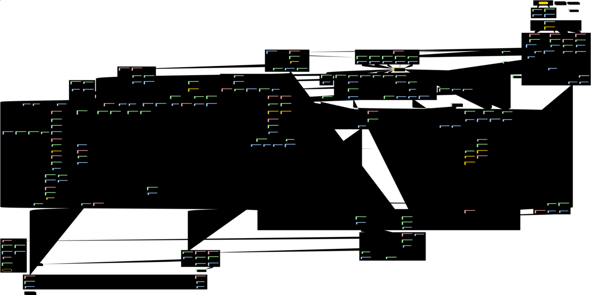

# King's Quest VI: Puzzle Dependencies

This chart maps the critical puzzle dependencies in Sierra's King's Quest VI (1992), showing which puzzles unlock access to subsequent challenges. Dependencies follow strict necessity rules—a puzzle B depends on puzzle A only if solving A is a prerequisite for even attempting B.

## Puzzle Dependency Flowchart

[](kings-quest-vi-chart.svg)

*Click the image to view the full-size version (opens in new tab).*

**Raw Mermaid Source**: [kings-quest-vi-chart.mmd](kings-quest-vi-chart.mmd)

## Locked Choice Mechanic

The Pawn Shop in the Village operates on a **locked choice system** where only one item can be unlocked at a time through trading:

### The Trade Chain

```
Copper Coin
    ↓ (Trade)
Nightingale
    ↓ (Trade)
Flute
    ↓ (Trade)
Tinderbox
    ↓ (Trade)
Paintbrush
```

### Implications for Puzzle Design

1. **Forks the Inventory**: Players must choose which path to pursue early
2. **Represents Lost Opportunities**: Trading away Nightingale means cannot use it for gnome puzzles later
3. **Strategic Sacrifice**: One-time trades require planning ahead
4. **Independent Discovery**: Players learn the chain through experimentation

### Dependency Note

For the purpose of this dependency chart, we treat each item as **UNLOCKED** at the moment of acquisition. The chart shows the locks (what's required to access an item) rather than the mini-game of sequential trading.

## Key Dependency Chains

### Long Path (Full Experience)

```
Magic Map → Five Gnomes → Isle of Wonder exploration → 
Isle of the Beast (initial) → Minotaur's Maze → 
Return with Shield → Logic Cliffs → Charm Spell → 
Realm of the Dead → Paint Door Castle Entry → Best Ending
```

### Short Path (Faster)

```
Magic Map → Five Gnomes → Isle of Wonder exploration → 
Isle of the Beast (initial) → Minotaur's Maze → 
Return with Shield → Beauty's Dress Disguise → Castle → Standard Ending
```

## Critical Item Dependencies

| Item | Source | Required For |
|------|--------|--------------|
| Royal Ring | Beach | Castle entry, Jollo trust, Sing-Sing delivery |
| Magic Map | Pawn Shop (trade Ring) | Access to all other islands |
| Nightingale | Pawn Shop (trade coin) | Five senses gnomes, guard distraction |
| Tinderbox | Pawn Shop (trade flute) | Dark cave, catacombs level 2 |
| Hole-in-Wall | Isle of Wonder garden | Catacombs spying room |
| Red Scarf | Chessboard Land | Minotaur lure |
| Shield | Catacombs | Archer statue protection |
| Dagger | Minotaur maze | Cassima's defense |
| Beauty's Dress | Beast's domain | Druid ceremony survival, disguise |
| Mirror | Beast's domain | Death's challenge |
| Skeleton Key | Realm of the Dead | Vizier's chest |
| Vizier's Letter | Vizier's chest | Saladin persuasion |

## Parallel Puzzle Paths

The game features parallel paths at several points where puzzles can be solved in any order:

1. **Village exploration**: Pawn Shop trading, Ferryman, Jollo, and Map trade are all independent
2. **Five Gnomes**: All five gnomes can be satisfied in any order
3. **Isle of Wonder**: Iceberg Lettuce, Flute/Flowers, and Tea Cup are independent
4. **Minotaur's Maze**: Tile puzzle, skull, coins, and brick are independent
5. **Isle of the Beast (return)**: Shield and Scythe (for hedge) are parallel paths
6. **Castle entry**: Paint door vs. Beauty's dress are two distinct paths that converge

## Node Naming Convention

This chart uses standardized naming for consistency:

- **`A_[action]`**: Action nodes (e.g., `A_TALK_TO_FERRYMAN`, `A_USE_SHIELD_STATUE`)
- **`O_[item]`**: Outcome nodes (e.g., `O_RECEIVE_RABBIT_FOOT`, `O_RECEIVE_MAGIC_MAP`)
- **`P_[problem]`**: Problem nodes (e.g., `P_PROBLEM_GNOMES`)
- **`C_[consequence]`**: Consequence nodes marking phase transitions

## Color Legend

| Node Type | Fill Color | Border Color |
|-----------|------------|--------------|
| START/END | Gold (#FFD700) | Dark Gold |
| Problems | Light Red (#FFB3B3) | Dark Red |
| Actions | Light Green (#B3FFB3) | Dark Green |
| Outcomes | Light Blue (#B3D9FF) | Dark Blue |

## Chart Configuration

This chart uses `flowchart TD` (top-down direction) for clear hierarchical flow from prerequisites through problem recognition to solution.

The chart is rendered as an **SVG** for crisp, zoomable quality. A PNG preview is embedded inline, with the full vector SVG available for download.

(End of file - total 111 lines)
