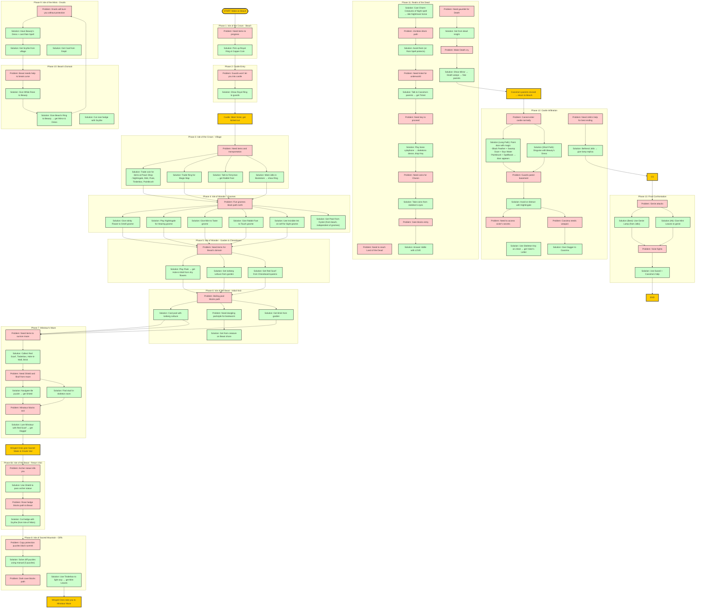

# King's Quest VI: Puzzle Dependencies

This chart maps the critical puzzle dependencies in Sierra's King's Quest VI (1992), showing which puzzles unlock access to subsequent challenges. Dependencies follow strict necessity rules—a puzzle B depends on puzzle A only if solving A is a prerequisite for even attempting B.

## Puzzle Dependency Flowchart

## Key Dependency Chains

### Long Path (Full Experience)
Magic Map → Isle of Wonder puzzles → Isle of the Beast (initial) → Minotaur's Maze → Isle of the Beast (return with Shield) → Logic Cliffs → Charm Spell → Realm of the Dead → Paint Door Castle Entry → Best Ending

### Short Path (Faster)
Magic Map → Isle of Wonder puzzles → Isle of the Beast (initial) → Minotaur's Maze → Isle of the Beast (return with Shield) → Disguise Entry → Castle → Standard Ending

## Critical Item Dependencies

| Item | Source | Required For |
|------|--------|--------------|
| Royal Ring | Beach | Castle entry, Jollo trust, Sing-Sing delivery |
| Magic Map | Pawn Shop (trade Ring) | Access to all other islands |
| Nightingale | Pawn Shop (trade coin) | Five senses gnomes, guard distraction |
| Tinderbox | Pawn Shop (trade flute) | Dark cave, catacombs level 2 |
| Hole-in-Wall | Isle of Wonder garden | Catacombs spying room |
| Red Scarf | Chessboard Land | Minotaur lure |
| Shield | Catacombs | Archer statue protection |
| Dagger | Minotaur maze | Cassima's defense |
| Beauty's Dress | Beast's domain | Druid ceremony survival, disguise |
| Mirror | Beast's domain | Death's challenge |
| Skeleton Key | Realm of the Dead | Vizier's chest |
| Vizier's Letter | Abdul's chest | Saladin persuasion |

## Parallel Puzzle Paths

The game features parallel paths at several points:

1. **Isle of Wonder exploration**: Five gnomes can be solved in any order
2. **Beast's domain**: Getting brick, meeting creature, and preparing for archers can overlap
3. **Castle entry**: Two distinct paths (paint door vs. disguise) converge at the finale

## Legend

- **Rectangles with sharp corners** (red tint): Problem nodes - obstacles or puzzles that must be solved
- **Rectangles with rounded corners** (green tint): Solution nodes - items collected or actions taken
- **Gold nodes**: START and END milestones
- **Arrows**: Dependency flow (solving A enables B)
