# King's Quest VII: The Princeless Bride (1994)

King's Quest VII is a 1994 Sierra On-Line adventure designed by Roberta Williams and Lorelei Shannon featuring dual protagonists—Princess Rosella and Queen Valanice—trapped in the dream-world of Eldritch after being pulled through a magical whirlpool. The game uses Disney-style cartoon graphics with hand-drawn backgrounds, divided into six chapters where each requires gathering specific items and completing multi-step tasks to progress [WTK][GW].

## At a Glance

| | |
|---|---|
| **Release Year** | 1994 |
| **Developer** | Sierra On-Line / Roberta Williams & Lorelei Shannon |
| **Core Mechanic** | Dual-character progression with chapter-based multi-faceted item collection |
| **What players found enjoyable** | "There are multiple paths in the game and different ways to complete each chapter" — non-linear puzzle chains allow creative problem-solving [GW]. One player noted: "look at your surroundings and take note of any items that you can interact with. Pick up an item and click it on the 'eye' to see it in more detail" — the detailed item examination system rewards thorough exploration [GW] |

<picture>
  <source media="(prefers-color-scheme: dark)" srcset="./kings-quest-vii-the-princeless-bride-chart.svg?dark">
  
</picture>

---

## Puzzle 1: The Mouse Rare Curiosities Trade Network

### Problem

Rosella must acquire a turquoise bead to unlock an ancient statue mechanism. A small mouse operates a door labeled "Rare Curiosities" in the desert ruins, but he cannot see without his glasses—which are nearby where a rabbit knocked them away. The player must first locate and retrieve the glasses, then use them as currency in a multi-step trade [WTK].

### What Makes It Rewarding

This puzzle establishes KQVII's information brokerage pattern early: every item has potential trade value depending on who you ask. The player must discover what the mouse needs (glasses), what they can offer in exchange (the gourd seed found just steps away), and crucially, that retrieving the glasses requires using the hunting horn to lure a jackalope out of its burrow. One walkthrough notes: "use the hunting horn on yourself, then use it on the rabbit's hole twice" — the specific click count matters [WTK]. This is precise mechanical design, not arbitrary action spam.

### Solution

The player trades the mouse his glasses for a turquoise bead needed to complete the statue mechanism.

### Steps
1. Use the hunting horn near the jackalope's burrow twice to lure it out
2. Collect the glasses and jackalope fur dropped by the rabbit/jackalope
3. Knock on the Rare Curiosities door to speak with the mouse
4. Give the mouse his glasses
5. Trade the gourd seed (found nearby at a dried gourd plant) in exchange for a turquoise bead

### Screenshots

[Information Brokerage Chain](../puzzles/information-brokerage.md) — Items are gathered specifically for trade with NPCs who need them (mouse needs glasses, gives bead). Unlike Sensory Exploitation, no NPC perception is being directly manipulated—this is a straightforward trade network chain.

---

## Puzzle 2: The Troll Transformation Sequence

### Problem

Queen Valanice, transformed into a troll princess named "Duck," must reverse the transformation by brewing a specific potion for the human girl Mathilde. The recipe requires five components gathered across different areas: green-tinted bowl, dragon scale, silver spoon, baked beetles, and green water from dye-maker's vats [WTK].

### What Makes It Rewarding

This is a tight multi-faceted plan where each component requires its own sub-puzzle, and all must be assembled at the end. The gold bowl must have "16k Gold" stamped on the bottom (if not, return it for another)—this explicit requirement prevents frustrating trial-and-error. Acquiring the silver spoon involves putting a box in water to reveal it, while the dragon scale is obtained only after trading a gem for hammer and chisel, then using those tools on the white dragon. Walkthrough notes: "give him the gem in exchange for his hammer and chisel" — clear cause-and-effect chain [WTK]. The satisfaction peaks when all five components are successfully given to Mathilde simultaneously.

### Solution

Valanice gives the complete potion ingredients to Mathilde, reverting her from troll back to human form; the silver spoon melts into a reusable silver pellet.

### Steps
1. Use toy rat on chef to distract him and gain kitchen access
2. Examine bowls' bottoms and select one marked "16k Gold"
3. Collect baked beetles from right of shelves
4. Enter dye-makers' cave via purple archway, fill gold bowl with green water
5. Light lantern at fire, burn sulfur to knock out troll worker, collect tongs
6. Retrieve silver spoon from box (put in bucket of water first)
7. Escape past guard by fixing broken cart wheel with shield and spike, then riding away
8. Trade gem for hammer/chisel with worker, use tools on white dragon for scale
9. Give bowl with green water, dragon scale, silver spoon, baked beetles to Mathilde

### Screenshots

[Multi-Faceted Plan](../puzzles/multi-faceted-plan.md) — Multiple independent requirements (five items from separate sub-puzzles) gathered in any order and synthesized at a single endpoint for the transformation. Distinguishes itself from Meta-Puzzle Construction because component outputs don't enable subsequent steps—they're all parallel tasks converging at Mathilde.

---

## Puzzle 3: The Harmonic Harp of Etheria

### Problem

In the dream realm of Etheria, Rosella must learn a specific harp melody to summon travel between realms (Etheria, Fates' island, Lady Ceres' tree). The correct sequence is visible but requires pattern observation rather than brute force: birds dance around the player revealing string positions. The exact pattern must be memorized and reproduced [WTK].

### What Makes It Rewarding

This puzzle rewards sustained attention over multiple visits. The first time in Etheria, birds dance near the harp but can't be directly controlled. Their flight pattern traces which strings to play—which only clicks on second exposure when you understand what you're looking for. Walkthrough explains: "Play the harp by pressing the bars in this pattern: 1, 5, 6, 4 (numbered left to right). This pattern is obtained from the birds that dance around you" [WTK]. The game establishes clear causality—birds' movements = playable sequence—and then requires memory rather than re-observation. This is distinct from pattern-learning where rules transfer; here, a specific sequence must be remembered and replayed.

### Solution

The correct harp melody (1-5-6-4) summons portal travel between Etheria and other dream realms.

### Steps
1. Enter the second screen in Etheria after first arrival
2. Observe birds dancing around the harp, noting which strings they fly near
3. Return to the harp on a subsequent visit
4. Press strings in the observed order: 1st, then 5th, then 6th, then 4th (left-numbered)
5. Successfully playing the melody activates realm travel capability

### Screenshots

[Observation Replay](../puzzles/observation-replay.md) — Information is gathered by watching an unrepeatable event (birds dancing), then replaying it from memory without being able to re-observe. Differs from Pattern Learning because specific sequence data is memorized rather than mechanical rules transferred to new contexts.

---

## Other Puzzles

| Name | Problem & Solution | Pattern Type |
|------|-------------------|--------------|
| Desert Cave Entrances | Plant corn kernel in damp soil, wait for growth, harvest ear; decode hieroglyphic clues to open sealed doors | [Symbol Code Translation](../puzzles/symbol-code-translation.md) |
| Gourd Seed Collection | Examine gourd plant twice (player's action changes its state from closed to open), then collect seed | [Observation Replay](../puzzles/observation-replay.md) |
| Statue Bead Puzzle | Move all beads to 3rd column on statue necklace via examination clicks; drains pool, reveals stairs | [Timed Consequence](../puzzles/timed-consequence.md) |
| Turkey Flag Scorpion Trap | Combine ripped petticoat with stick to make flag, place on scorpion to immobilize it | [Meta-Puzzle Construction](../puzzles/sequential-construction.md) |
| Moon Retrieval from Pond | Place rubber chicken in tree branch nest, insert fallen moon inside; chicken launches it skyward on spring | [Surreal Logic Bridge](../puzzles/surreal-logic-bridge.md) |
| Graveyard Lock (Skull-Bat-Spider) | Press three symbols in correct sequence on coffin door to reveal hidden entrance with Troll King trapped inside | [Symbol Code Translation](../puzzles/symbol-code-translation.md) |
| Horseman Quest for Head | Push lid off second coffin, retrieve Horseman's head; give to passing spirit rider for reward fife | [Multi-Faceted Plan](../puzzles/multi-faceted-plan.md) |
| Malicia's Lamp Crystal | Time house entry to avoid dog patrols by walking away and returning until silent; collect lamp crystal during stealth window | [Corporate Infiltration](../puzzles/distraction-environmental-manipulation.md) |

---

### References

[WTK] Ashley Bennett, The Walkthrough King (2004). https://www.walkthroughking.com/text/kingsquest7.aspx

[GW] Gamer Walkthroughs, King's Quest 7 Full Chapter Guide. https://gamerwalkthroughs.com/kings-quest-7/
