# Monkey Island (1990)

Monkey Island is a 1990 Lucasfilm Games adventure designed by Ron Gilbert that established the "no death, no dead ends" philosophy now standard in point-and-click design. Players control Guybrush Threepwood as he completes three pirate trials to become a real pirate, gathers four map pieces across multiple islands, and confronts the ghost pirate LeChuck. The game features pattern-learning combat without violence, multi-island logistics puzzles, and a hint system that tracks player progress—and as one walkthrough describes it: "the puzzle design, top to bottom, is just superb, managing to be funny and clever and occasionally challenging without ever devolving into the random using of each object on each other object" [Maher].

## At a Glance

| | |
|---|---|
| **Release Year** | 1990 |
| **Developer** | Lucasfilm Games / Ron Gilbert |
| **Core Mechanic** | Multi-phase progression: learn pattern → gather components in parallel → synthesize final solution |
| **What players found enjoyable** | "It's as strong a comedy adventure as you'll ever see, and as historically important an adventure game as any released since Crowther and Woods's seminal original Adventure" [Maher]. The insult sword-fighting became iconic: "you need to collect these insults and their ripostes as you explore, then apply them just right to win the sword fight" [Maher] |

## Puzzle Dependency Chart

The chart below shows the complete puzzle flow for Monkey Island 1, from initial trials through final confrontation. View it as interactive SVG in the generated book or see the [source mermaid diagram](./monkey-island-1-chart.mmd).

---

## Puzzle 1: Insult Sword Fighting via Pattern Learning

### Problem

To become a pirate, Guybrush must pass three trials. The first is defeating the swordmaster in combat—but swords aren't used physically. Instead, pirates duel through escalating insults and comebacks. There are exactly seven insult-comeback pairs to learn, and each must be memorized by talking to various NPC pirates around Melee Island before challenging the master again. The player discovers through losing their first fight that knowledge—not reflexes or items—solves this puzzle [Maher][GameFAQs].

### What Makes It Rewarding

This is pure pattern-learning mechanics: the game teaches through NPC dialogue ("You fight like a dairy farmer!"), player attempts (losing first fight), then systematic training (learning all 7 pairs). Unlike traditional combat, there's no timing or skill component—only correct recall under sequence pressure. Most importantly, it's mechanically non-violent despite simulating combat: "With a verbal joust being far easier to implement in an adventure game than a sword-fighting engine, it didn't take him long to run with this idea" [Maher]. Player satisfaction comes from perfect execution: selecting all seven pairs flawlessly to defeat the master.

### Solution

The player learns all seven insult-comeback pairs through NPC conversations, then applies them in correct order during rematch—the swordmaster is defeated without violence through mastered verbal combat patterns.

### Steps

1. Go to beach south of town and find Sword Fightin' Guy
2. Challenge him initially; lose the first fight when running out of insults
3. Return to Scumm Bar; talk to three pirates in corner about insults
4. Learn insult #1: "You fight like a dairy farmer!" → comeback: "How appropriate, you fight like a cow."
5. Learn insult #2: "This is the END for you, you gutter trash!" → comeback: "So you're related to one, are you?"
6. Learn insult #3: "People fall at my feet when they see me coming!" → comeback: "Even BEFORE they smell your breath?"
7. Learn insult #4: "I once owned a dog that was smarter than you." → comeback: "You must have bought him off the boat dock."
8. Learn insult #5: "You're so ugly that when you cry, the tears run down the back of your head." → comeback: "Must be the wind I smell then."
9. Learn insult #6: "There's no hope for you, boy!" → comeback: "I had a dream about you once. Now I know it was just a nightmare."
10. Learn insult #7: "Your mother was a hamster and your father smelt of elderberries!" → comeback: "And your mother was a rhubarb pie, so back off, laddie!"
11. Return to Sword Fightin' Guy on the beach
12. Challenge him again; cycle through all 7 insult-comeback pairs correctly
13. Defeat is achieved; sword trial is complete

### Screenshots

[Pattern Learning](../puzzles/pattern-learning.md) — Knowledge acquired through exposure (insults from NPCs) must be recalled correctly during application phase (the duel), distinguishing this from Symbol Code Translation which requires systematic deduction rather than direct memorization.

---

## Puzzle 2: Multi-Island Map Piece Collection via Parallel Multi-Faceted Plan

### Problem

After passing the three trials, Guybrush receives a ship and crew. The final objective requires locating LeChuck's Fortress—but its coordinates are hidden across four separate map pieces on different islands. Each piece requires entirely independent solutions: Scabb Island needs environmental distraction, Booty Island requires social manipulation with cannibals, Phatt Island involves library exploration, and the fourth is already on Melee (the Wharf). The player can tackle these in any order; each path gathers one critical component before final synthesis [GameFAQs][Walkthrough].

### What Makes It Rewarding

This is classic multi-faceted plan design: all requirements are gatherable independently before the final combination. Unlike sequential construction where step N enables step N+1, here Scabb's chandelier diversion has no mechanical connection to Booty's cannibal negotiation or Phatt's library search. Player can work on any branch first—the game respects their choice. The synthesis is elegantly simple: combine all 4 pieces and the full map appears. What's satisfying is realizing these three complex puzzles were parallel tracks converging into one trivial-but-meaningful finale [Maher].

### Solution

Four map pieces are collected through independent sub-puzzles on separate islands, then combined to reveal LeChuck's Fortress coordinates—the player navigates there using the complete chart.

### Steps

1. **Scabb Island (Lagoon Map Piece)**
   - Sail to Scabb Island; enter Governor Marley's mansion
   - Locate can of oil in kitchen cabinets
   - Climb ladder near chandelier in main hall
   - Use oil on chandelier pulley mechanism
   - Use rubber chicken (from thievery trial) on oiled pulley
   - Chandelier crashes down, creating diversion that sends guards running
   - Sneak upstairs while chaos persists; open safe; collect Lagoon map piece

2. **Booty Island (Forest Map Piece)**
   - Sail to Booty Island; enter swamp area
   - Approach cannibal village; get captured by natives
   - Escape cooking pot through quick-time dialogue option
   - Answer riddle: "How do you get ahead?" → Response: "Lean forward!"
   - Become cannibal chief through successful wordplay; receive Forest map piece

3. **Phatt Island (Underworld Map Piece)**
   - Sail to Phatt Island; explore Governor Phatt's mansion
   - Enter library/study area on upper floor
   - Search bookshelves for hidden compartment
   - Collect Underworld map piece from concealed location

4. **Melee Island (Wharf Map Piece)**
   - This piece starts in inventory after trial completion OR:
   - Purchase from map vendor during initial exploration; Wharf is local to Melee

5. Return to ship with all four pieces in inventory
6. Use map combination interface to assemble complete chart
7. Navigate to revealed fortress coordinates using ship movement controls

### Screenshots

[Multi-Faceted Plan](../puzzles/multi-faceted-plan.md) — Multiple requirements (Scabb distraction, Booty riddle, Phatt library search) gathered across different categories before synthesis (map assembly), distinguishing this from Sequential Construction where each step enables the next rather than working in parallel.

---

## Puzzle 3: Defeating LeChuck via Sensory Exploitation

### Problem

LeChuck is a ghost pirate—immune to conventional weapons including swords, fire, and physical attacks. Guybrush must discover his weakness through observation or experimentation: root beer causes ghosts pain (carbonated beverages are uncomfortable for undead creatures). Finding the root beer itself requires navigating LeChuck's Fortress kitchen during infiltration—no items from earlier puzzles combine into this solution. This is pure sensory exploitation: exploit supernatural vulnerability directly [GameFAQs].

### What Makes It Rewarding

The "ghosts hate root beer" logic follows adventure game surrealism while maintaining internal consistency: LeChuck is explicitly a ghost throughout the game, and carbonation is established folklore as disturbing spirits. Player must recognize the supernatural category (ghost → vulnerable to sensory attacks rather than physical weapons) then find the item with appropriate properties (root beer's effervescence). The challenge isn't the logic—it's locating the kitchen during fortress infiltration while being pursued by LeChuck's minions. This distinguishes it from comedy-based persuasion where NPCs respond socially; ghosts simply don't process dialogue [Maher].

### Solution

Root beer is located in fortress kitchen, then used on LeChuck during final confrontation—carbonated liquid exploits ghost vulnerability, defeating him without traditional combat and freeing Elaine from captivity.

### Steps

1. Sail to LeChuck's Fortress using coordinates from combined map
2. Navigate through fortress grounds, avoiding/evading skeletal minions
3. Enter fortress interior; locate kitchen area
4. Search counters and storage cabinets for beverages
5. Find bottle of root beer in refrigerator/cupboard
6. Take root beer into inventory (now usable)
7. Proceed to fortress chapel where LeChuck holds captive Elaine
8. Confront LeChuck directly; initiate final battle
9. Select root beer from interaction menu (not swords or other items)
10. Use root beer on LeChuck—spectral being reacts in pain
11. Carbonation causes LeChuck to expand and explode, dissolving him completely
12. Elaine is freed from captivity; both escape the collapsing fortress

### Screenshots

[Sensory Exploitation](../puzzles/sensory-exploitation.md) — Character perceives through specific weakness (ghost's sensory channel), player exploits that vulnerability directly (carbonated beverage causes pain) rather than using social manipulation or physical force, distinguishing this from Comedy-Based Persuasion where NPCs respond to dialogue rather than physiological triggers.

---

## Other Puzzles

| Name | Problem & Solution | Pattern Type |
|------|-------------------|--------------|
| Thievery Trial: Rubber Chicken Theft | Distract dog with shovelful of dirt while stealing rubber chicken from carpenter shop | [Distraction & Environmental Manipulation](../puzzles/distraction-environmental-manipulation.md) |
| Lookout Spyglass Purchase | Buy spyglass key from Scumm Bar bartender; use it to access lookout; reveal Shipwreck Island location for treasure trial | [Information Brokerage Chain](../puzzles/information-brokerage.md) |
| Ship Acquisition Protocol | Show all trial completions AND four map pieces to dockmaster—both requirements must be satisfied simultaneously for reward | [Multi-Faceted Plan](../puzzles/multi-faceted-plan.md) |
| Phatt Island Jail Escape (Chapter 2 only) | Use rope pulley system with timing constraint; requires coordinating escape mechanism activation | [Timed Consequence](../puzzles/timed-consequence.md) |
| Elaine's Map Piece via Fish & Ladder | Steal map piece from Governor during party, then retrieve second half later using fishing pole and boat ladder positioning | [Sequential Construction](../puzzles/sequential-construction.md) |

---

## References

[Maher] Jimmy Maher, "Monkey Island (or, How Ron Gilbert Made an Adventure Game That Didn't Suck)" *The Digital Antiquarian* (March 10, 2017). https://www.filfre.net/2017/03/monkey-island-or-how-ron-gilbert-made-an-adventure-game-that-didnt-suck

[GameFAQs] Tom Hayes, "The Secret of Monkey Island – Walkthrough and FAQ" (June 6, 2008). https://gamefaqs.gamespot.com/pc/579134-the-secret-of-monkey-island/faqs/5034

[Walkthrough] Anonymous Contributor, "Monkey Island Complete Strategy Guide" (undated), archived walkthrough collection. Repository file: `/src/walkthroughs/monkey-island-1/monkey-island-1-walkthrough.md`
