# Space Quest II: The Vohaul Assault (1987)

Space Quest II continues Roger Wilco's janitorial misadventures with enhanced mechanical complexity while maintaining absurdist comedy as core design. Players must navigate jungle survival, alien village diplomacy, and fortress infiltration using items like spores for knockouts, berries for taste-based camouflage, and a simple plunger to escape acid traps. The walkthrough authors capture the consistent internal logic: one notes "the janitor can also be a hero" while emphasizing that "this game is one of the worst when it comes to deaths or situations which make the game unfinishable" [Tricky], establishing both accessibility and unforgiving state-tracking design hallmarks.

## At a Glance

| | |
|---|---|
| **Release Year** | 1987 |
| **Developer** | Sierra On-Line / Scott Murphy, Mark Crowe, and Al Lowe (Two Guys From Andromeda) |
| **Core Mechanic** | State-dependent item chains where mundane objects gain critical functions through environmental manipulation (berries mask taste, spores incapacitate, plunger creates acid-trap anchor) |
| **What players found enjoyable** | "If you are not rubbed in berries you're dead (if you are rubbed the monster will spit you out as you taste disgusting)" [Tricky]—the sensory disguise mechanic turns biology into gameplay. Second walkthrough adds command precision: "rub berries on body" then "take deep breath" demonstrates fair gatekeeping [StrategyWiki] |

<picture>
  <source media="(prefers-color-scheme: dark)" srcset="./spacequest-2-the-vohaul-assault-chart.svg?dark">
  
</picture>

---

---

## Puzzle 1: Swamp Monster Sensory Disguise via Bery Rubbing

### Problem

After crashlanding on the alien planet, Roger must cross a swamp guarded by a carnivorous monster that eats anything attempting passage. The solution requires finding berries in the jungle maze, then applying them to his skin through an explicit command interaction. One walkthrough specifies: "GET BERRIES" from bush past slime maze, then later "RUB BERRIES ON BODY"—making the taste-based camouflage mechanically explicit rather than implicit [Tricky].

### What Makes It Rewarding

This puzzle transforms biological properties into mechanical rules: berries are not just inventory; they must be *rubbed on body* to alter how the world responds to Roger. The player learns through documentation that "the berries make you taste bad, the monster will spit you out, and thus you survive" [Tricky]—establishing consistent cause-and-effect rather than magic immunity. Unlike traditional disguise puzzles where costumes hide visual appearance, this exploits sensory perception (taste) as a vulnerability window. Fair design gates progress meaningfully: attempt crossing without berries triggers death; with berries, the monster's attack animation plays then reverses, providing immediate feedback on mechanic activation [StrategyWiki].

### Solution

Berries are collected from jungle bush, rubbed onto Roger's body to create bad taste, allowing him to survive swamp monster attack and continue across water.

### Steps

1. Navigate through slime beast maze avoiding trails that attract the monster
2. Reach bush at back of maze; type "GET BERRIES"
3. Return through maze; exit jungle heading toward swamp entrance
4. Before entering water, type "RUB BERRIES ON BODY" command
5. Enter swamp water; swim east toward monster territory
6. Monster appears and attempts to eat Roger
7. Watch animation: monster bites then spits Roger out due to bad taste
8. Continue swimming past now-finished monster encounter
9. Navigate around until sinking point behind east tree
10. Type "TAKE DEEP BREATH" for underwater cave access

[Sensory Exploitation](../puzzles/sensory-exploitation.md) — NPC perception vulnerability exploited through item application altering biological response (taste), distinguishing from Corporate Infiltration where visual uniform changes create authorization rather than sensory-based survival.

### Screenshots

| | |
|---|---|
|  | **Before:** Approaching swamp with berries in inventory but not yet applied |
|  | **After:** Monster attack reversed, player survives and can continue swimming past |

---

## Puzzle 2: Rock Monster Distraction via Whistle and Puzzle Combination

### Problem

A large rock monster blocks passage in the jungle, but can be temporarily distracted using two specific items found earlier in the game. Roger must blow a whistle (mail-ordered from the mailbox) to summon the creature, then throw a puzzle piece at it while it approaches. The StrategyWiki walkthrough breaks this into precise sequence: "use whistle" then "throw puzzle" as separate commands [StrategyWiki]. Timing matters—if the monster reaches Roger before hitting enter on the throw command, death occurs.

### What Makes It Rewarding

This creates a two-step cause-and-effect chain where items serve distinct mechanical roles: whistle summons, puzzle distracts. The walkthrough emphasizes precision: "Best way to go is to type the command before the monster appears and not to hit enter until the monster actually goes to you" [Tricky]. Unlike simple distraction puzzles where any noise works, this requires *specific* objects—the rock monster only responds to whistle (not generic noise) and puzzles (not rocks or other throwable items). The reward is procedural: monster makes a hole while distracted, yielding a *rock* item essential for the next puzzle stage (knocking out guards with sling). Fair design provides both items early (locker + mailbox) so failure stems from execution timing rather than resource scarcity [StrategyWiki].

### Solution

Whistle summons rock monster; throwing puzzle distracts it while it digs hole, allowing Roger to retrieve critical rock item for subsequent guard knockout.

### Steps

1. Ensure whistle in inventory (mailed after submitting order form at mailbox)
2. Reach area with large rock near jungle entrance
3. Approach monster spawn point from safety position
4. Type "BLOW WHISTLE" or "USE WHISTLE" command
5. Watch for monster to appear and begin charging toward Roger
6. Before monster reaches player, type "THROW PUZZLE" command
7. Hold enter until monster is within range of thrown object
8. Release; puzzle hits monster and triggers distraction animation
9. Monster digs hole in ground while distracted
10. Walk to hole; type "GET ROCK" from excavation site
11. Exit area north toward base entrance

[Distraction Physics](../puzzles/distraction-environmental-manipulation.md) — Environmental hazard (monster) neutralized through timed item deployment creating exploitable window, distinguishing from Sensory Exploitation where NPC perception is bypassed rather than actively redirected through physics interaction.

### Screenshots

| | |
|---|---|
|  | **Before:** Whistle blown, monster approaching with player holding THROW PUZZLE command |
|  | **After:** Monster neutralized, hole contains retrievable rock item needed for guard knockout |

---

## Puzzle 3: Acid Trap Escape via Plunger Anchor and Fire Sprinkler Activation

### Problem

In Vohaul's fortress, Roger must navigate a corridor with deadly acid trap floor plates that open suddenly beneath the player. The solution requires three items across multiple floors: plunger (from 3rd floor closet), waste basket (from 5th floor janitorial closet), toilet paper (from 4th floor restroom). When trapped in the open pit, the plunger anchors Roger to prevent falling; then lighting the paper in the basket triggers sprinklers that disable killer robots. One walkthrough explains: "STICK PLUNGER ON BARRIER" before trap opens, then "PUT PAPER IN BASKET", "LIGHT BASKET" [Tricky].

### What Makes It Rewarding

This puzzle combines immediate self-preservation (plunger anchor) with environmental manipulation (fire sprinkler). The walkthrough notes precision timing: "If you do this too soon, you'll sooner or later release grip due to exhaustion getting yourself still killed" [Tricky]—establishing state-dependent success beyond simple item use. Unlike single-purpose tool puzzles, the plunger saves Roger temporarily but doesn't solve the larger problem; sprinkler activation requires collecting paper from *restroom* specifically (generic paper won't work) and basket from *closet*. Multi-floor collection across levels 3-5 creates logistical memory: player must remember which floor has which item during fortress exploration. Fair design ensures all items are found in clearly marked locations before acid trap corridor access [StrategyWiki].

### Solution

Plunger anchors Roger to wall barrier during acid trap opening; burning paper in basket triggers sprinkler system that kills corridor robots, enabling safe passage east toward Vohaul's office.

### Steps

1. On 5th floor: enter janitorial closet; GET BASKET, OVERALLS, LIGHTER
2. On 4th floor: enter restroom; open second cubicle door; GET PAPER
3. On 3rd floor: enter closet east of elevator; GET PLUNGER
4. Return to ground level bay area; head east toward acid corridor
5. Before stepping on trap floor, type "STICK PLUNGER ON BARRIER" but hold enter
6. Walk onto trap plate; watch floor open beneath Roger
7. Hit enter quickly; plunger grips and prevents falling into acid
8. Wait until pit closes completely
9. Type "PUT PAPER IN BASKET" command
10. Type "PUT BASKET ON FLOOR" position
11. Type "LIGHT BASKET" or "LIGHT PAPER" with lighter
12. Fire triggers sprinkler system activation animation
13. Sprinklers kill all killer robots in corridor
14. Exit east safely past neutralized robot threat

[Multi-Faceted Plan](../puzzles/multi-faceted-plan.md) — Multiple requirements gathered across different locations (plunger, basket, paper from separate floors) synthesized at climax moment for compound outcome (escape + robot neutralization), distinguishing from Meta-Puzzle Construction where sequential outputs chain rather than parallel collection converges.

### Screenshots

| | |
|---|---|
|  | **Before:** Plunger anchored, acid pit open, player suspended above deadly acid |
|  | **After:** Sprinklers triggered, corridor safe to exit east toward Vohaul's office |

---

## Other Puzzles

| Name | Problem & Solution | Pattern Type |
|------|-------------------|--------------|
| Mail Order Whistle Purchase | Submit order form at mailbox; receive whistle for later monster distraction use | [Information Brokerage](../puzzles/information-brokerage.md) |
| Hunter Knockout via Spores | Throw spore cloud at hunter after talking twice; steal keys from unconscious body to unlock cage door | [Sensory Exploitation](../puzzles/sensory-exploitation.md) |
| Rope Bridge Construction | Tie rope to fallen log bridge; climb down and swing across monster gap with precise F6 timing to reach cave entrance | [Timed Consequence](../puzzles/timed-consequence.md) |
| Alien Village Translator Use | Say dialect word learned from translator device; aliens move rock revealing secret passage downward | [Symbol Code Translation](../puzzles/symbol-code-translation.md) |
| Keycard Door Authorization | Insert keycard (stolen from crash victim) into door panel at Vohaul's base; access spaceship interior controls | [Corporate Infiltration](../puzzles/distraction-environmental-manipulation.md) |
| Shrink Beam Reversal via Computer | After being shrunk by Vohaul: escape glass, climb vent to life support system, press button, pull switch at computer, TYPE "ENLARGE" command to restore size | [Meta-Puzzle Construction](../puzzles/sequential-construction.md) |
| Oxygen Mask Breath Protection | Collect oxygen mask from broken tube corridor; WEAR MASK before continuing or suffocation occurs when glass breaks under Vohaul's attack | [Timed Consequence](../puzzles/timed-consequence.md) |
| Kissing Disease Gatekeeping | Avoid kissing monster encounter on 5th floor entirely; if kissed, contract incurable disease that kills player during later Vohaul confrontation | [Timed Consequence](../puzzles/timed-consequence.md) |

---

### References

[Tricky] Jeroen Broks, "Space Quest II: Chapter II - Vohaul's Revenge Walkthrough," GameFAQs (archived 2019). https://web.archive.org/web/20190509091827/https://gamefaqs.gamespot.com/pc/565075-space-quest-ii-chapter-ii-vohauls-revenge/faqs/54103

[StrategyWiki] StrategyWiki Community, "Space Quest II: Vohaul's Revenge/Command Line Walkthrough," StrategyWiki (2007). https://strategywiki.org/wiki/Space_Quest_II:_Vohaul's_Revenge/Command_Line_Walkthrough
